<h1 align="center">Diario Oficial Chile - Laws & Decrees Delta Feed</h1>

<p align="center">
  <strong>A pay-per-event monitor for Chile's official gazette — laws, decrees and resolutions, extracted the day they publish, on a schedule you configure.</strong>
</p>

<p align="center">
  <a href="https://apify.com"></a>
  
  
  
</p>

<p align="center">
  <a href="https://apify.com/stefano_seggio/diario-oficial-cl-monitor">
    
  </a>
</p>

<p align="center">
  <sub>Owner console reference: <a href="https://console.apify.com/actors/qfBeEKuLfYUw9UOuW">console.apify.com/actors/qfBeEKuLfYUw9UOuW</a></sub>
</p>

---

## What it does

Chile's Diario Oficial (official gazette) is the country's system of record for new laws, decrees, resolutions and regulatory notices — but the source itself, `diariooficial.interior.gob.cl`, exposes no public API and no filtering: just today's edition rendered as one long hierarchical table, re-published fresh every business day. Reading it by hand means opening the page, scrolling the whole table, and manually tracking which branch of government, ministry or agency each entry belongs to, every single publishing day.

**diario-oficial-cl-monitor** resolves today's edition automatically, extracts every entry from the sections you select with its full `rama` / `ministerio` / `organismo` government hierarchy and a direct per-publication PDF link, and classifies each entry against a persisted history of what this Actor has already seen. Point it at a recurring Apify schedule with delta mode (`onlyNew`) enabled, and each run returns only the publications that are genuinely new or corrected since the last check — not the whole table re-read from scratch. In effect, it's the API alternative diariooficial.interior.gob.cl never shipped: structured JSON in, official gazette monitoring out.

Legal and compliance teams use it to catch new regulations in their sector the day they appear; law firms use it to catch a *fe de erratas* (a correction re-published under the same CVE with amended text) before advising a client on stale wording; regulatory intelligence teams use it to trend publishing activity by ministry and section across recurring runs, without re-reading the same edition by eye.

## Architecture

```mermaid
flowchart LR
    A["diariooficial.interior.gob.cl"] --> B["Resolve today's edition<br/>via the site's own redirect"]
    B --> C["Fetch each selected section<br/>native fetch + backoff retry<br/>no Crawlee/CheerioCrawler"]
    C --> D["Parse table rows:<br/>rama / ministerio / organismo hierarchy"]
    D --> E["Derive record_id:<br/>CVE, or content-hash fallback"]
    E --> F["Diff against persisted seen-set<br/>Apify key-value store, 20,000-entry cap"]
    F --> G["Classify: NEW_LISTING / UPDATED / UNCHANGED"]
    G --> H{"onlyNew enabled?"}
    H -->|yes| I["Keep NEW_LISTING + UPDATED only"]
    H -->|no| J["Keep every classified record"]
    I --> K["Push to dataset"]
    J --> K
    K --> L["Charge: result event"]
```



A section with nothing published that day returns a 404 from the source and is skipped as expected, not logged as a failure — this domain has no "closed" or status-change concept, since a published legal notice is a permanent public record. The only thing an already-seen entry can do is get corrected, which is why `UPDATED` exists alongside `NEW_LISTING`.

## Features

| Feature | Grounded in |
| --- | --- |
| Full government hierarchy per entry (`rama`, `ministerio`, `organismo`) | Inherited from the last heading seen while walking the edition's table top to bottom |
| Direct per-publication PDF link (`pdfUrl` / `source_url`) | Points at the official PDF when the source provides one, not a shared section page |
| Section selection (`sections`) | 7 selectable sections; `normas_generales` is confirmed live, the rest share the same parser |
| Delta mode (`onlyNew`) | Persisted key-value store tracks up to 20,000 recently seen entries across runs |
| Correction detection (`event_type: UPDATED`) | SHA-1 content fingerprint over hierarchy + description + PDF link, compared run to run |
| Event-type filter (`eventTypes`) | Deliver `NEW_LISTING`, `UPDATED`, or both, when `onlyNew` is on |
| Hard result cap (`maxItems`) | Caps total publications returned per run across all selected sections |
| No Crawlee dependency | The source blocks Crawlee's `CheerioCrawler` (`got-scraping`) fingerprint outright; this Actor fetches with plain `fetch()` instead |

## Cost & BYOK Disclosure

**Pricing model:** pay-per-event, one flat metered event — no separate detail/summary tier and no compute charge on top.

| Event | Price | Triggered when |
| --- | --- | --- |
| `result` (gazette publication) | $0.003 | Once per publication record pushed to the dataset |

There's only one metered event, and it's a flat rate: every entry is already fully parsed inline from the section table on the way in, so a record from `normas_generales` costs the same as one from `bom`, and `NEW_LISTING` costs the same as `UPDATED` — no hidden per-section markup. Always confirm the current rate on the [Store pricing tab](https://apify.com/stefano_seggio/diario-oficial-cl-monitor) before estimating cost at scale.

**Delta suppression, never a refund.** Every entry is fingerprinted with a SHA-1 hash over its government hierarchy, description and PDF link (`src/fingerprint.ts`). A publication whose fingerprint matches what was already recorded for that CVE (or content-hash fallback id) in the persisted key-value store is classified `UNCHANGED` and is never pushed to the dataset — that comparison happens *before* delivery, so an unchanged entry is simply never billed, not refunded after the fact.

**BYOK:** This Actor requires no third-party API key. The Diario Oficial is a public Chilean government gazette with no login wall or provider key of any kind.

## Quickstart

Run it directly with the Apify CLI, the REST API, or the `apify-client` SDK in Python or Node.js — this pulls today's Normas Generales edition, capped at 100 entries, in delta mode.

### Apify CLI

```bash
apify call diario-oficial-cl-monitor --input '{
  "sections": ["normas_generales", "marcas_patentes"],
  "maxItems": 100,
  "onlyNew": true,
  "eventTypes": ["NEW_LISTING", "UPDATED"]
}'
```

### cURL (instant, synchronous)

Runs synchronously and returns the resulting dataset items directly in the response - no polling needed. Get your token from [console.apify.com/settings/integrations](https://console.apify.com/settings/integrations).

```bash
curl -X POST "https://api.apify.com/v2/acts/qfBeEKuLfYUw9UOuW/run-sync-get-dataset-items?token=<YOUR_API_TOKEN>" \
  -H "Content-Type: application/json" \
  -d '{
  "maxItems": 50,
  "onlyNew": true
}'
```

### Python (`apify-client`)

```python
import os
from apify_client import ApifyClient

client = ApifyClient(os.environ["APIFY_TOKEN"])

run_input = {
    "sections": ["normas_generales"],
    "maxItems": 100,
    "onlyNew": True,
    "eventTypes": ["NEW_LISTING", "UPDATED"],
}

run = client.actor("stefano_seggio/diario-oficial-cl-monitor").call(run_input=run_input)

dataset_items = client.dataset(run["defaultDatasetId"]).list_items().items
for item in dataset_items:
    print(f"- [{item['event_type']}] {item['ministerio']}: {item['descripcion']}")
```

A full runnable version of this script is at `examples/run_monitor.py` in this repo.

### Node.js (`apify-client`)

```javascript
import { ApifyClient } from 'apify-client';

const client = new ApifyClient({ token: process.env.APIFY_TOKEN });

const run = await client.actor('stefano_seggio/diario-oficial-cl-monitor').call({
  sections: ['normas_generales'],
  maxItems: 100,
  onlyNew: true,
  eventTypes: ['NEW_LISTING', 'UPDATED'],
});

const { items } = await client.dataset(run.defaultDatasetId).listItems();
for (const item of items) {
  console.log(`- [${item.event_type}] ${item.ministerio}: ${item.descripcion}`);
}
```

A full runnable version (CommonJS) is at `examples/run-monitor.js` in this repo.

## Input & Output Schema

### Input

| Field | Type | Default | Description |
| --- | --- | --- | --- |
| `sections` | array | `["normas_generales"]` | Which of the 7 edition sections to fetch: `normas_generales`, `avisos_destacados`, `marcas_patentes`, `normas_particulares`, `publicaciones_judiciales`, `empresas_cooperativas`, `bom`. A section with nothing published that day returns 404 and is skipped, not treated as an error. |
| `maxItems` | integer | `300` | Hard cap on the number of publications returned this run, across all selected sections. |
| `onlyNew` | boolean | `false` | Delta mode: return only `NEW_LISTING` (never seen) or `UPDATED` (a correction to a known entry, same CVE, amended content) since a prior run today, tracked in a named key-value store. |
| `eventTypes` | array | `["NEW_LISTING", "UPDATED"]` | Which of those two event kinds to deliver when `onlyNew` is on; ignored (everything delivered) when it's off. |

Only today's edition is retrievable — the Actor has no historical-date input, for reasons covered under Known limitations below.

### Output

One real record from this Actor's own dataset, matching `.actor/dataset_schema.json`:

```json
{
  "rama": "Poder Ejecutivo",
  "ministerio": "Ministerio de Hacienda",
  "organismo": "Servicio de Impuestos Internos",
  "descripcion": "Resolucion Exenta que modifica instrucciones sobre declaracion jurada N 1948",
  "pdfUrl": "https://www.diariooficial.interior.gob.cl/publicaciones/2026/09/15/45305/01/2465981.pdf",
  "source_url": "https://www.diariooficial.interior.gob.cl/publicaciones/2026/09/15/45305/01/2465981.pdf",
  "cve": "2465981",
  "record_id": "2465981",
  "seccion": "normas_generales",
  "edicion": "45305",
  "fecha": "15-09-2026",
  "event_type": "NEW_LISTING",
  "is_new": true,
  "contentHash": "1f4b7d03a8f1e6c9b2d45071c8e3f6b9d2a5c8e",
  "scrapedAt": "2026-09-15T13:00:04.000Z"
}
```

| Field | Description |
| --- | --- |
| `rama` / `ministerio` / `organismo` | Branch of government, ministry, and sub-agency the entry is filed under, inherited from the last heading walked in the edition table. |
| `descripcion` | The publication entry text itself. |
| `pdfUrl` / `source_url` | Direct link to the official per-publication PDF, when the source provides one. |
| `cve` / `record_id` | The Codigo de Verificacion Electronica (the source's own per-publication id); `record_id` falls back to a content hash on the rare occasion the link text doesn't match the expected CVE pattern. |
| `seccion` / `edicion` / `fecha` | Which section, edition number, and edition date (`DD-MM-YYYY`) the entry belongs to. |
| `event_type` / `is_new` | `NEW_LISTING`, `UPDATED`, or `UNCHANGED` (only surfaced when `onlyNew` is off), plus a boolean flag for whether this id was already in the persisted seen-set. |
| `contentHash` / `scrapedAt` | The SHA-1 fingerprint used to detect `UPDATED` corrections between runs, and the ISO timestamp of extraction. |

## Why not just scrape it yourself

- **Zero infrastructure.** No server, cron box, or headless browser to provision and patch — Apify runs the schedule and stores the runs.
- **The bot-check is already solved.** The source's default HTTP fingerprint check blocks a standard `CheerioCrawler` client outright (verified live against the identical URL); this Actor already works around that with a hand-tuned `fetch()` plus exponential-backoff retry loop, so you don't have to reverse-engineer it yourself.
- **No proxy or session babysitting.** There's no login wall or rotating proxy pool to maintain here — just a resolver that follows the site's own redirect to today's edition and a retry loop tuned to its real behavior.
- **Delta/change detection comes built in.** A persisted key-value store carries CVE identity and content fingerprints across runs, so `onlyNew` gives you new-and-corrected entries only, instead of you designing and maintaining that state store yourself.

## Known limitations

- Only today's edition is supported — no reliable way to resolve an arbitrary past date's edition number was found, so there is no historical-date input.
- Of the seven selectable sections, only `normas_generales` had confirmed real content at audit time; the other six are wired against the same parser but have not each been verified end-to-end with live data.
- This Actor is maintained by an independent developer, not a staffed vendor team — there is no contractual uptime SLA. Bugs and coverage requests are handled through the Apify Store's Issues tab, typically within 48 hours.

## Contributing & Local Setup

This repository contains the Actor's real, buildable TypeScript source (`src/`), not just documentation:

```bash
git clone https://github.com/stefanoseggio/diario-oficial-cl-monitor.git
cd diario-oficial-cl-monitor
npm install
apify login              # paste your Apify API token
npm run start:dev        # tsx src/main.ts - runs the Actor locally against the real source
npm test                 # vitest run
```

`npm run build` compiles with `tsc`, and `npm run lint` / `npm run format` run this repo's ESLint/Prettier config. Found a bug, or want a new section, output field, or historical-date capability covered? Open an issue or pull request on this GitHub repo, or use the **Issues** tab on the [Apify Store listing](https://apify.com/stefano_seggio/diario-oficial-cl-monitor) for operational reports against the live Actor.

---

<p align="center">
  <sub>
    Part of <strong>Delta Registry</strong> — pay-per-event regulatory &amp; compliance data infrastructure, monitoring official gazettes and public registries so teams don't have to read them by hand.
    <br>
    Professional inquiries / enterprise licensing: <a href="https://www.linkedin.com/in/stefanoseggio-deltaregistry">LinkedIn</a> ·
    Rest of the fleet: <a href="https://github.com/stefanoseggio">github.com/stefanoseggio</a>
  </sub>
</p>
